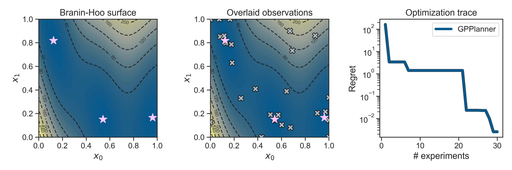

Welcome to Atlas' documentation!
==================================

.. image:: _static/atlas_logo.png

**Atlas**  is an chemistry and materials science adaptive experimentation package. ::

    from olympus import Surface, Campaign
    from atlas.planners.gp.planner import GPPlanner

    surface = Surface(kind='Branin') # instantiate 2d Branin-Hoo objective function

    campaign = Campaign() # define Olympus campaign object 
    campaign.set_param_space(surface.param_space)

    planner = GPPlanner(goal='minimize', num_init_design=5) # instantiate Atlas planner 
    planner.set_param_space(surface.param_space)

    while len(campaign.observations.get_values()) < 30:
        samples = planner.recommend(campaign.observations) # ask planner for batch of parameters 
        for sample in samples:
            measurement = surface.run(sample) # measure Branin-Hoo function
            campaign.add_observation(sample, measurement) # tell planner about most recent observation

.. toctree::
   :maxdepth: 1
   :caption: Getting Started

   overview
   install
   credits
   support

.. toctree::
   :maxdepth: 1
   :caption: Examples

   examples/notebooks/single_obj
   examples/notebooks/known_constraints
   examples/notebooks/unknown_constraints
   examples/notebooks/multi_obj
   examples/notebooks/general
   examples/notebooks/robust
   examples/notebooks/multi_fidelity
   examples/notebooks/meta_learning
   examples/notebooks/molecular

.. toctree::
   :maxdepth: 1
   :caption: Core Classes

   classes/planners/index
   classes/gps/index
   classes/acquisition_functions/index
   classes/acquisition_optimizers/index
   classes/known_constraints

.. toctree::
   :maxdepth: 1
   :caption: Advanced Usage

   custom_dummy

.. toctree::
   :maxdepth: 10
   :caption: Complete API Reference

    apidoc/atlas
